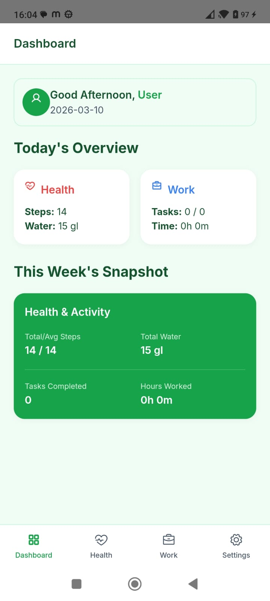
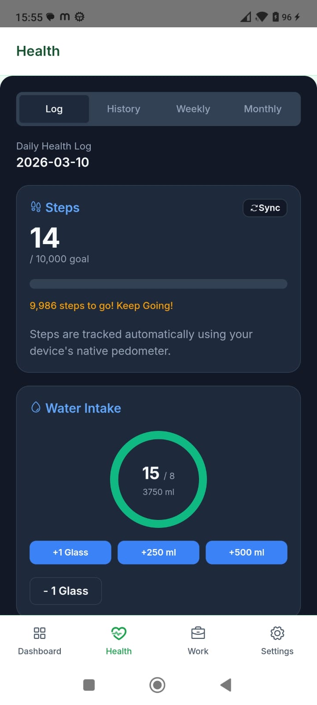
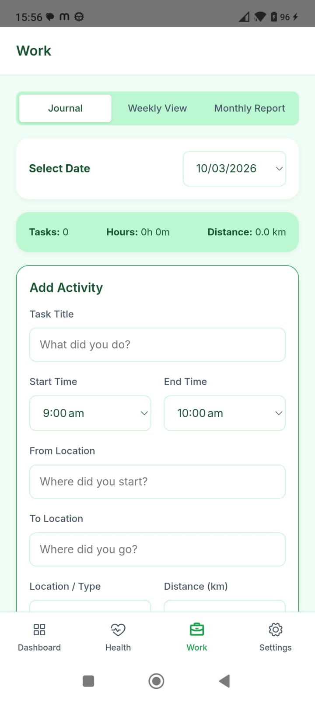

# 📱 Personal Dashboard — Health & Work Tracker

> An all-in-one personal productivity app to track your daily steps, water intake, and work activities — built with Capacitor and deployed as a native Android app.

---

## ✨ Features

### 🏃 Health Module
- **Native Step Counter** – Uses the device's built-in hardware pedometer via Android's `TYPE_STEP_COUNTER` sensor (same sensor used by Google Fit).
- **Water Intake Tracker** – Log glasses/ml with circular progress rings.
- **Weekly & Monthly Reports** – Beautiful charts showing your health trends over time.

### 💼 Work Module
- **Task Logger** – Log your daily work tasks with time, project, location, and status.
- **Weekly Activity Journal** – See all your work at a glance.
- **PDF & Excel Export** – Export monthly reports natively on Android using the device Share sheet.

### 📊 Dashboard
- At-a-glance daily summary of health + work stats.
- Weekly trend cards.

---

## 📸 Screenshots


| Dashboard | Health Tab | Work Tab |
|---|---|---|
|  |  |  |

---

## 🛠️ Tech Stack

| Technology | Purpose |
|---|---|
| HTML / CSS / JavaScript | Core web app |
| [Capacitor](https://capacitorjs.com/) | Native Android runtime |
| `@dreiver1/capacitor-step-counter` | Native pedometer access |
| `@capacitor/filesystem` | Native file writing |
| `@capacitor/share` | Android Share sheet |
| `esbuild` | JS bundler for Capacitor WebView |
| Chart.js | Health & work report charts |
| html2pdf.js | PDF generation |
| xlsx-js-style | Excel export |

---

## 🚀 Getting Started

### Prerequisites
- Node.js >= 18
- Android Studio (with Android SDK)
- Java JDK 21 (bundled with Android Studio)

### Install Dependencies
```bash
npm install
```

### Build Web Assets
```bash
node build.js
```

### Sync with Android
```bash
npx cap sync android
```

### Run on Device / Emulator
Open `android/` folder in **Android Studio** and click **Run** or:
```bash
npx cap run android
```

---

## 📦 Building a Release APK / AAB

1. Open `android/` in Android Studio.
2. Go to **Build → Generate Signed Bundle / APK**.
3. Select **Android App Bundle** → create or use your keystore → build **Release**.
4. Upload to [Google Play Console](https://play.google.com/console).

---

## 📁 Project Structure

```
personal-dashboard/
├── css/              # App styles
├── js/
│   ├── views/        # Health, Work, Dashboard view modules
│   ├── app.js        # Main router & navigation
│   ├── storage.js    # Local data persistence
│   └── utils.js      # Utilities: date helpers, exports, downloads
├── android/          # Capacitor Android project
├── index.html        # Entry HTML
├── build.js          # Custom build script (copies to www/ + esbuild bundle)
├── capacitor.config.json
└── package.json
```

---

## 🔒 Permissions Used

| Permission | Reason |
|---|---|
| `INTERNET` | Load CDN resources (Chart.js, fonts) |
| `ACTIVITY_RECOGNITION` | Access native hardware step counter |

---

## 📝 License

MIT License — feel free to use, modify, and distribute.

---

## 👨‍💻 Author

**Srinivas P** ([@psrinivas143](https://github.com/psrinivas143))

---

## 🤖 Built With AI Assistance

This app was designed and developed with the help of modern AI and developer tools:

| Tool | Role |
|---|---|
| 🤖 **[Antigravity AI](https://antigravity.dev)** (by Google DeepMind) | AI pair-programmer — wrote code, debugged native plugins, and solved Capacitor integration issues |
| 🤖 **AI-assisted code generation** | HTML, CSS, JavaScript architecture and all view modules |
| 🛠️ **Android Studio** | Native Android build, signing, and deployment |
| 📱 **Capacitor** | Bridged web app to native Android hardware APIs |

> _"Built with the power of AI pair programming — showing that modern AI tools can take an idea from concept to a fully functional native Android app."_
